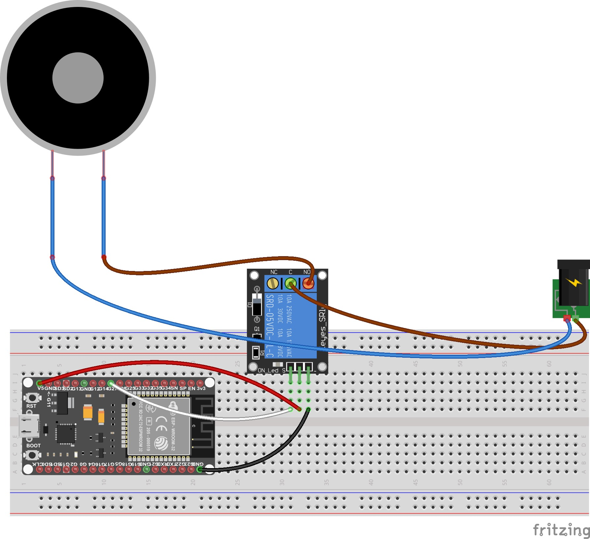

# Vhodno izhodne naprave

## Projektna naloga: daljinsko upravljena elektromagnetna ključavnica

### Anže Vidmar, 63200319

#### Uvod

Glavna ideja projektne naloge je ustvariti elektromagnetno ključavnico ki jo je možno upravljati preko spletnega vmesnika. Uporabnik lahko na lokalnem in zunanjem omrežju (z uporabo katerekoli pametne naprave ki podpira brskalnike) dostopa do spletne strani preko IP naslova strežnika in ustreznega prehoda, ali pa preko javnega IP naslova usmerjevalnika in ustreznega prehoda. Ko se uporabnik poveže se mu prikaže spletni vmesnik z gumbom, s katerim lahko vklopi ali izklopi ključavnico.

#### Komponente

1. Elektromagnet
2. Rele
3. ESP32
4. 24V napajalnik
5. Breadboard
6. Žice

#### Programska oprema, ogrodja in knjižice

- Visual Studio Code: https://code.visualstudio.com
- PlatformIO: https://platformio.org
- Fritzing: https://fritzing.org
- Pomoč za ESP32 spletni strežnik: https://randomnerdtutorials.com/esp32-web-server-arduino-ide/
- WiFi Library for Arduino: https://github.com/arduino-libraries/WiFi

#### Koda

```c++
#include <WiFi.h>
 
const char * ssid = "SSID";
const char * password =  "password"; 
const char * host = "192.168.1.6";
int port = 6753;

int send = true;
int magnet = 27;
bool magnetState = false;
bool firstConnection = true;

WiFiServer server(5000);

unsigned long currentTime = millis();
unsigned long previousTime = 0; 
const long timeoutTime = 2000;

String header;
 
void setup()
{
 
  Serial.begin(115200);

  pinMode(magnet, OUTPUT);

  WiFi.begin(ssid, password);
  while (WiFi.status() != WL_CONNECTED) {
    delay(500);
  }

  server.begin();
}
 
void loop()
{
  WiFiClient client = server.available();
  if (client) {
    currentTime = millis();
    previousTime = currentTime;
    String currentLine = "";              
    while (client.connected() && currentTime - previousTime <= timeoutTime) {  
      currentTime = millis();
      if (client.available()) {            
        char c = client.read();             
        header += c;
        if (c == '\n') {
          if (currentLine.length() == 0) {
            client.println("HTTP/1.1 200 OK");
            client.println("Content-type:text/html");
            client.println("Connection: close");
            client.println();

            client.println("<!DOCTYPE html>");
            client.println("<html style='height:100%; margin:0px'>");
            client.println("    <head>");
            client.println("        <title>Remote Lock</title>");
            client.println("        <meta charset='UTF-8'>");
            client.println("        <meta name='viewport' content='width=device-width, initial-scale=1'>");
            client.println("        <style>");
            client.println("            .button {");
            client.println("                display: inline-block;");
            client.println("                padding: 15px 25px;");
            client.println("                font-size: 50px;");
            client.println("                height:200px; ");
            client.println("                width:350px;");
            client.println("                cursor: pointer;");
            client.println("                text-align: center;");
            client.println("                text-decoration: none;");
            client.println("                outline: none;");
            client.println("                color: #fff;");

            if (firstConnection) {
              if (!magnetState) {   
              client.println("                background-color: firebrick;");
              client.println("                border: none;");
              client.println("                border-radius: 15px;");
              client.println("                box-shadow: 0 3px #999;");
              client.println("            }");
              client.println("            .button:hover {            ");
              client.println("                background-color: rgb(124, 27, 27);");
              client.println("            }");
              client.println("            .button:active {");
              client.println("                background-color: rgb(124, 27, 27);");
              client.println("                box-shadow: 0 3px #666;");
              client.println("                transform: translateY(4px);");
              client.println("            }");
              client.println("        </style>");
              client.println("    </head>");
              client.println("    <body style='height:100%; width:100%; margin:0px'>");
              client.println("        <div style='height: 100%; width:100%; display: flex; align-items: center; justify-content: center;'>");
              client.println("            <a href='/lock'><button class='button'>LOCK</button></a>");
              client.println("        </div>");
              client.println("    </body>");
              client.println("</html>");
              client.println();
              digitalWrite(magnet, LOW);
              magnetState = true;
              }
              else if (magnetState) {
                client.println("                background-color: mediumseagreen;");
                client.println("                border: none;");
                client.println("                border-radius: 15px;");
                client.println("                box-shadow: 0 3px #999;");
                client.println("            }");
                client.println("            .button:hover {            ");
                client.println("                background-color: rgb(44, 136, 85);");
                client.println("            }");
                client.println("            .button:active {");
                client.println("                background-color: rgb(44, 136, 85);");
                client.println("                box-shadow: 0 3px #666;");
                client.println("                transform: translateY(4px);");
                client.println("            }");
                client.println("        </style>");
                client.println("    </head>");
                client.println("    <body style='height:100%; width:100%; margin:0px'>");
                client.println("        <div style='height: 100%; width:100%; display: flex; align-items: center; justify-content: center;'>");
                client.println("            <a href='/unlock'><button class='button'>UNLOCK</button></a>");
                client.println("        </div>");
                client.println("    </body>");
                client.println("</html>");
                client.println();
                digitalWrite(magnet, HIGH);
                magnetState = false;
              }
              firstConnection = false;
              break;
            }
            else {
              if (header.indexOf("GET /unlock") >= 0) {
                client.println("                background-color: firebrick;");
                client.println("                border: none;");
                client.println("                border-radius: 15px;");
                client.println("                box-shadow: 0 3px #999;");
                client.println("            }");
                client.println("            .button:hover {            ");
                client.println("                background-color: rgb(124, 27, 27);");
                client.println("            }");
                client.println("            .button:active {");
                client.println("                background-color: rgb(124, 27, 27);");
                client.println("                box-shadow: 0 3px #666;");
                client.println("                transform: translateY(4px);");
                client.println("            }");
                client.println("        </style>");
                client.println("    </head>");
                client.println("    <body style='height:100%; width:100%; margin:0px'>");
                client.println("        <div style='height: 100%; width:100%; display: flex; align-items: center; justify-content: center;'>");
                client.println("            <a href='/lock'><button class='button'>LOCK</button></a>");
                client.println("        </div>");
                client.println("    </body>");
                client.println("</html>");
                client.println();
                digitalWrite(magnet, HIGH);
                magnetState = false;
              }
              else if (header.indexOf("GET /lock") >= 0) {
                client.println("                background-color: mediumseagreen;");
                client.println("                border: none;");
                client.println("                border-radius: 15px;");
                client.println("                box-shadow: 0 3px #999;");
                client.println("            }");
                client.println("            .button:hover {            ");
                client.println("                background-color: rgb(44, 136, 85);");
                client.println("            }");
                client.println("            .button:active {");
                client.println("                background-color: rgb(44, 136, 85);");
                client.println("                box-shadow: 0 3px #666;");
                client.println("                transform: translateY(4px);");
                client.println("            }");
                client.println("        </style>");
                client.println("    </head>");
                client.println("    <body style='height:100%; width:100%; margin:0px'>");
                client.println("        <div style='height: 100%; width:100%; display: flex; align-items: center; justify-content: center;'>");
                client.println("            <a href='/unlock'><button class='button'>UNLOCK</button></a>");
                client.println("        </div>");
                client.println("    </body>");
                client.println("</html>");
                client.println();
                digitalWrite(magnet, LOW);
                magnetState = true;
              }
              break;
            }
          }
        }
      }
    }
    firstConnection = true;
    header = "";
    client.stop();
  }
}
```


#### Vezje




#### Delovanje

Na začetku povežemo ESP32 z domačim omrežjem. V kodi imamo spremenljivke `ssid`, `password`, `host` in `port` ki hranijo niz SSID-ja in gesla lokalnega omrežja, IP naslov ki ga bo pridobil ESP32 strežnik ter vrata za dostop iz zunanjega omrežja.  Nato nastavimo vrata strežnika na `5000`. V `setup()` funkciji naprej brezžično povežemo ESP32 na lokalno omrežje, nato pa strežnik poženemo. V `loop()` funkciji čakamo oz. preverjamo, če se je na strežnik povezal odjemalec. V primeru da se je in dobimo nazaj ustrezen HTTP zahtevek, na njega odgovrimo z HTTP odgovorom ki prikaže spletno stran z gumbom. Ko odjemalec prejme HTTP odgovor, lahko ob pritisku gumba vklopi ali izklopi ključavnico oz. elektromagnet. Ob pritisku na gumb se pošlje GET zahtevek. Tega preverimo, če v URL-ju vsebuje `/lock` ali pa `/unlock`. Če vsebuje `/lock`, potem strežnik odgovori s spletno stranjo ki vsebuje gumb *UNLOCK*, hkrati pa nastavi stanje PIN-a 27 na *HIGH*, tako da se elektromagnet vklopi. V nasprotnem primeru, ko dobimo `/unlock`, se prikaže gumb *LOCK*, stanje PIN-a 27 pa se nastavi na *LOW*, torej se elektromagnet izklopi.


https://user-images.githubusercontent.com/68665243/176149464-ba055d45-168d-4cec-9e80-e42c1924b5d3.mp4


|  |      |
| :----------------------------------------------------------: | ---- |

#### Zaključek

Končen projekt deluje tako kot bi pričakovali. Za resno uporabo bi bilo potrebno zgraditi še ohišje ki hrani vse komponente. Prav tako bi morali še testirati moč samega elektromagneta, da bi preprečili odpiranje vrat z dovolj močno silo.

Pomembna je tudi varnost oz. zaščita z geslom V tem primeru je bila spletna stran dostopna iz zunanjega in notranjega omrežja brez kakršnega koli gesla, zato bi lahko napadalci upravljali ključavnico brez dovoljenja.  
